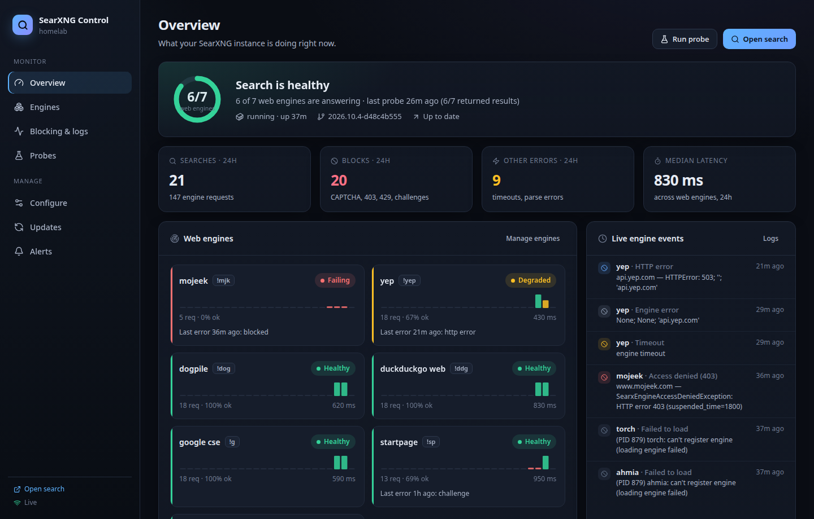
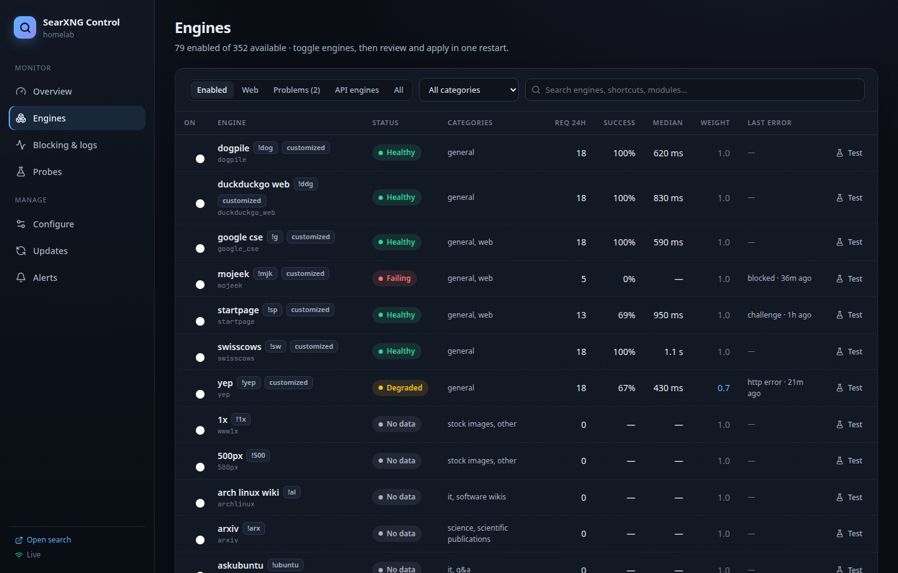
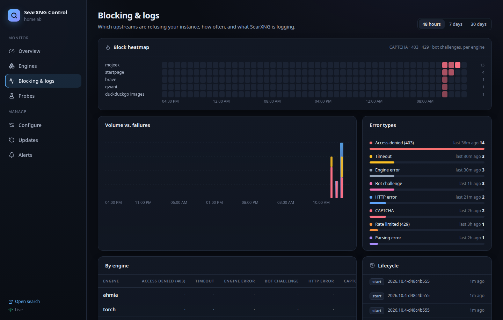
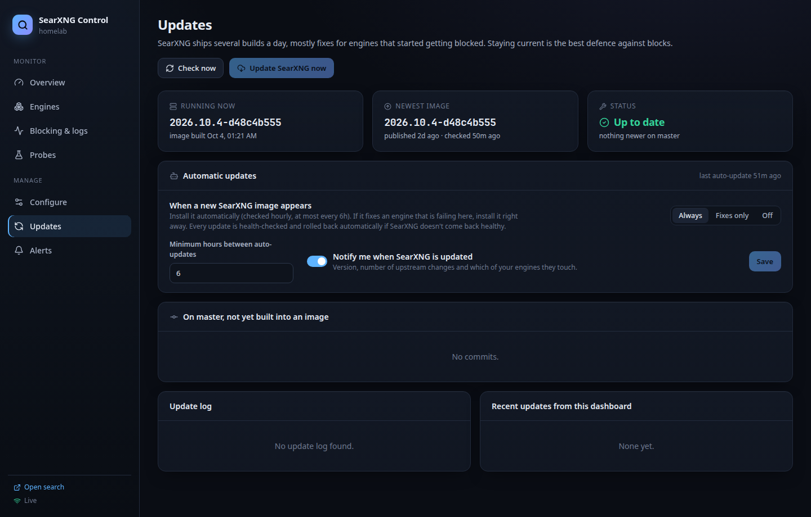

# SearXNG Control

A monitoring and control panel for a self-hosted [SearXNG](https://docs.searxng.org/) instance.

SearXNG doesn't have an index of its own: it scrapes Google, Bing, Startpage, DuckDuckGo, Mojeek and friends,
and those upstreams fight scrapers with CAPTCHAs, 403s and rate limits. SearXNG ships several builds a day to
keep up. SearXNG Control answers three questions at a glance:

1. **Is search working right now, and which engines are being blocked?**
2. **Can I fix it from here?** Toggle engines, add API keys, tune weights and site rules, or edit
   `settings.yml` directly. Every change is previewed, backed up, verified and rolled back automatically if it
   breaks SearXNG.
3. **Is there an upstream fix I'm missing?** It tracks new SearXNG images, shows the commits that touch
   *your* engines, and can update SearXNG automatically.



## Features

- **Overview**: health ring (web engines answering), searches, blocks and errors over 24 h, per-engine tiles
  with hourly success sparklines, a live feed of engine failures, active alerts and update status.
- **Engines**: every engine the SearXNG image ships (~350), with status, traffic, success rate, latency and
  last error. Toggle several and apply them with one restart. Each engine has a panel with a 48 h chart, error
  breakdown, probe history, a one-click test search, and settings (enable, weight, timeout, bang, API key,
  private).
- **Blocking & logs**: engine × time heatmap of CAPTCHA/403/429/challenge events, error types, per-engine
  table, lifecycle (restarts, applies, rollbacks, updates), searchable event history and a live `docker logs`
  tail.
- **Probes**: a real canary search every 30 min, so you know an engine is down even when nobody is
  searching. Shown as an engine × probe matrix.
- **Configure**:
  - search behaviour (autocomplete, safe search, language, timeouts, suspension times)
  - site rules (remove / push down / boost / rewrite hostnames)
  - **API engines** (Brave Search API, Exa, Marginalia, …) with optional *private* token-gating, so a metered
    API only serves your own browsers, not bots or AI tools
  - custom engines from templates (Kagi API, any JSON API, XPath scraper, MediaWiki, Discourse)
  - a raw `settings.yml` editor and backups with diff + restore

  `settings.yml` comments and formatting are preserved.
- **Updates**:
  - the running image vs. the newest Docker Hub build, and the commits in between (highlighting the ones that
    touch engines you use)
  - an "Update now" button
  - **automatic updates**: *Always* (at most every N hours, and immediately when a new image fixes an engine
    that's failing for you), *Fixes only*, or *Off*
  - every update is health-checked and rolled back if SearXNG doesn't come back
- **Alerts**: container down, SearXNG unhealthy, too few web engines working, an engine down for N hours, a
  fix available for a failing engine, update overdue or failed. Delivered via [ntfy](https://ntfy.sh) (or
  Unraid notifications in agent mode), on open and on resolve.

| Engines | Blocking & logs | Updates |
|---|---|---|
|  |  |  |

## Quick start (Docker Compose)

```sh
mkdir searxng-stack && cd searxng-stack
curl -fsSLO https://raw.githubusercontent.com/ghreprimand/searxng-control/main/examples/docker-compose.yml
mkdir searxng && curl -fsSL -o searxng/settings.yml \
  https://raw.githubusercontent.com/ghreprimand/searxng-control/main/examples/searxng/settings.yml
# edit searxng/settings.yml: replace both "change-me" values (openssl rand -hex 32)
docker compose up -d
```

- SearXNG: <http://localhost:8080>
- SearXNG Control: <http://localhost:8890>

Already running SearXNG? Add the `searxng-control` service from the example compose file. Point
`SEARXNG_URL`/`SEARXNG_CONTAINER` at your instance and mount the directory that holds its `settings.yml`.
SearXNG's settings need two things:

```yaml
general:
  open_metrics: "some-random-string"   # lets the panel read /metrics
search:
  formats: [html, json]                # json is used for probes and tests
```

The Overview page lists anything that's still missing under **Finish setup**.

Adding it to an existing SearXNG, Unraid, remote access over Tailscale or a reverse proxy:
[docs/DEPLOYMENT.md](docs/DEPLOYMENT.md). **Unraid:** see [docs/UNRAID.md](docs/UNRAID.md). There's a container template, and an optional host agent
so updates go through Unraid's own template machinery and alerts arrive as Unraid notifications.

## Private engines: keep paid APIs for yourself

API engines such as the Brave Search API (independent index, about 1,000 free searches a month) never get
CAPTCHA'd, which makes them a great backbone. But anything that calls SearXNG's JSON API, like AI tools,
scripts or this panel's own probes, would use up the free allowance quickly.

Mark the engine **Private** (Engines → engine → *Private*, or Configure → API engines). SearXNG then only uses
it for requests carrying a secret **engine token**:

1. The panel generates the token and shows it, with a copy button, at the top of the Engines page.
2. In each browser you use, open SearXNG → *Preferences → General → Engine tokens*, paste it, *Save*. It's
   stored in that browser's SearXNG cookie.
3. Searches from those browsers include the private engine. Requests without the token (API clients,
   probes, other people on your instance) don't, so they never touch the API.

Details and provider comparison: [docs/API-ENGINES.md](docs/API-ENGINES.md).

## Documentation

- [Deployment](docs/DEPLOYMENT.md): compose, adding it to an existing SearXNG, Unraid, remote access, updating
- [Configuration](docs/CONFIGURATION.md): every environment variable
- [API engines](docs/API-ENGINES.md): results that don't get blocked (Brave Search API, Exa, …) and private
  engines
- [Browsers](docs/BROWSERS.md): making SearXNG your default search engine on each browser/OS
- [Architecture](docs/ARCHITECTURE.md) and [HTTP API](docs/API.md)

## Security

SearXNG Control mounts the Docker socket (root-equivalent on the host). It can rewrite SearXNG's settings and
recreate its container. It has **no login unless you set `CONTROL_PASSWORD`** (HTTP basic auth, user `admin`).
Keep it on localhost, your LAN or a VPN such as Tailscale/WireGuard, or put it behind a reverse proxy with
authentication. Don't publish it to the internet.

It only ever touches the configured SearXNG container: inspect, logs, read files from its image, restart, and
(in docker update mode) pull + recreate.

API keys live in SearXNG's `settings.yml`, as SearXNG requires; the API never returns them. Search queries are
never stored:
- log lines are reduced to engine, error type, upstream *host* and exception text
- canary probes use a fixed list of harmless phrases
- the live log view streams raw container lines to your browser without storing them

## Configuration

All configuration is via environment variables. See [docs/CONFIGURATION.md](docs/CONFIGURATION.md). The
important ones:

| Variable | Default | |
|---|---|---|
| `SEARXNG_URL` | `http://searxng:8080` | how the panel reaches SearXNG |
| `SEARXNG_PUBLIC_URL` | = `SEARXNG_URL` | your browser's URL for SearXNG (links) |
| `SEARXNG_CONTAINER` | `searxng` | container to monitor/restart/update |
| `SEARXNG_SETTINGS` | `/searxng/settings.yml` | SearXNG's settings file (mounted read-write) |
| `UPDATE_METHOD` | `docker` | `docker`, `agent` or `none` |
| `CONTROL_PASSWORD` | — | enable basic auth |

## How it works

One Python process (FastAPI + asyncio) serves the API and the built React UI and runs background collectors:
- SearXNG's `/metrics` for traffic
- the container's log stream for every engine failure
- periodic canary searches
- Docker Hub/GitHub for upstream changes

History lives in SQLite. Details: [docs/ARCHITECTURE.md](docs/ARCHITECTURE.md). HTTP API:
[docs/API.md](docs/API.md) (OpenAPI at `/api/docs`).

## Development

```sh
# API on :8890 (point it at any SearXNG; Docker features optional)
cd backend && python -m venv .venv && .venv/bin/pip install -r requirements-dev.txt
SEARXNG_URL=http://localhost:8080 SEARXNG_SETTINGS=/path/to/settings.yml DATA_DIR=/tmp/sxc \
  .venv/bin/python -m searxng_control.main
# UI on :5173 with hot reload, proxying /api to :8890
cd frontend && npm install && npm run dev
# tests / type-check
cd backend && .venv/bin/python -m pytest
cd frontend && npx tsc -b
```

`ENABLE_DOCKER=0` runs without the Docker socket (no logs, restarts, updates or engine catalog). To use a
remote Docker host while developing, forward its socket:
`ssh -nNT -L /tmp/docker.sock:/var/run/docker.sock host`, then set `DOCKER_SOCKET=/tmp/docker.sock`.

## License

MIT. SearXNG Control is an independent project and is not affiliated with SearXNG.
